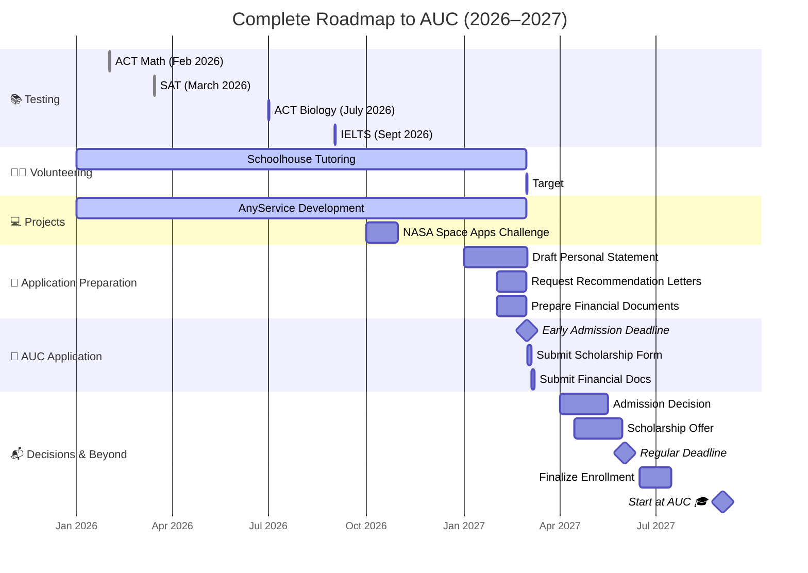

# 👋 Hi, I'm Abdelrahman Mostafa

**Aspiring Computer Engineer • Future AUC Student • FSAE Enthusiast • Motorsport • Big Tech • USA Masters Pathway**

I'm a Grade 11 student based in Saudi Arabia, studying in a Cognia-accredited American curriculum school. I'm passionate about building software that simulates, analyzes, and optimizes systems — with a long‑term goal of working at a top tech company like **Google, Meta, or Microsoft**, and pursuing a master's degree in the **USA**.

---

## 🎯 My Academic & Career Pathway

- **Fall 2027:** Apply to **The American University in Cairo (AUC)**  
  *Bachelor of Science in Computer Engineering*  
  *Interests: Embedded Systems • Artificial Intelligence • Systems Design • Motorsport Applications*

- **During University:**  
  Gain hands-on experience through projects, research, internships, and competitive programming — aiming for opportunities at top tech companies

- **After Graduation:**  
  Pursue a **master's degree in the USA** in a field like Computer Engineering, AI, or Embedded Systems

- **Long‑Term Vision:**  
  Work as a software or systems engineer at **Google, Meta, or Microsoft** — contributing to impactful technology while staying connected to my passion for motorsport and simulation

---

## 🛠️ Technologies I'm Learning

**Languages:** Python, C++, JavaScript  
**Tools:** Git, GitHub, VS Code
**Interests:** Vehicle dynamics, data analysis, simulation, embedded systems, web development, AI/ML, systems design

---

## 🚀 Current Projects

| Project | Description | Status |
| :--- | :--- | :--- |
| **Vehicle Dynamics Calculator** | Modular Python-based simulator for FSAE vehicle systems (aero, brakes, chassis, tires, etc.) | ✅ Active |
| **FSAE Telemetry Simulator** | Data analysis and visualization tool for lap times, fuel usage, tire wear, and race strategy | ✅ Active |
| **FSAE Electronics Simulator** | Exploring hardware/software integration for embedded systems in motorsport | ✅ Active |
| **Home Online Services Website** | Full-stack web development project — building a platform to connect users with local service providers | 🚧 In Progress |

---

## 🌟 Achievements & Involvement

- **4.0 GPA** (Grade 11, American Diploma)
- **SAT:** 1390 (790 Math, 600 EBRW) — targeting 1500+
- **ACT Subject Tests (AIST):** Math 1 — 36 | Biology — 36 (predicted)
- **NASA Space Apps Challenge 2026** — Selected participant
- **Cognia-Accredited School** — Egyptian equivalency path secured for AUC

---

## 📈 Goals for 2026–2027

- ✅ Maintain 4.0 GPA
- ⏳ Achieve 1500+ SAT
- ⏳ Complete 100+ volunteer hours (Schoolhouse)
- ⏳ Build and launch home services website
- ⏳ Take IELTS/TOEFL for English proficiency
- ⏳ Apply to AUC by **March 1, 2027** (early admission)
- ⏳ Secure strong scholarship (target: 100% tuition)
- ⏳ Build projects that strengthen my path toward **big tech + USA master's**

#### 📅 My Complete Roadmap to AUC (2026–2027)

---

## 📫 Connect With Me

**GitHub:** ``AbdelrahmanMostafa-Eng``
**LinkedIn:** ``www.linkedin.com/in/abbelrahmanmostafa-eng`` 
**Instagram:** ``77abdelrahmanmostafa77``

---

🚀 *Thanks for visiting my profile! I'm building a future in computer engineering, big tech, and beyond — one project at a time.*
