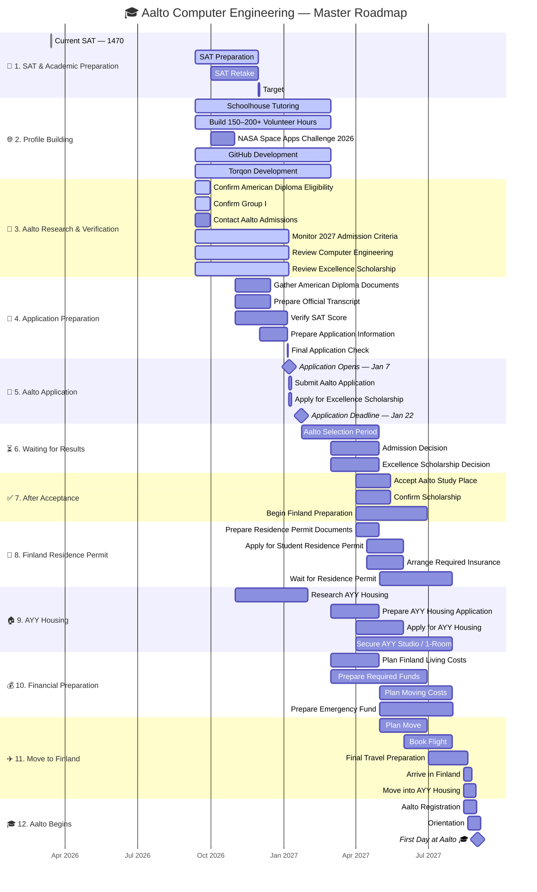

# 👋 Hi, I'm Abdelrahman Mostafa

**Aspiring Computer Engineer • Future Aalto Student • FSAE Enthusiast • Motorsport • Big Tech • Netherlands Masters Pathway**

I'm a Grade 11 student based in Saudi Arabia, studying in a Cognia-accredited American curriculum school. I'm passionate about building software that simulates, analyzes, and optimizes systems — with a long‑term goal of working at a top tech company like **ASML**, and pursuing a master's degree in the **Netherlands**.

---

## 🎯 My Academic & Career Pathway

- **Jan 2027:** Apply to **Aalto University**  
  *Bachelor of Science and Technology in **Computer Engineering***  
  *Interests: Embedded Systems • Artificial Intelligence • Systems Design • Motorsport Applications*

- **During University:**  
  Gain hands-on experience through projects, research, internships, and competitive programming — aiming for opportunities at top tech companies

- **After Graduation:**  
  Pursue a **master's degree in the Netherlands** in a field like Computer Engineering, AI, or Embedded Systems

- **Long‑Term Vision:**  
  Work as a software or systems engineer at **ASML** — contributing to impactful technology while staying connected to my passion for motorsport and simulation

---

## 🛠️ Technologies I'm Learning

**Languages:** Python, C++, JavaScript, TypeScript

**Tools:** Git, GitHub, VS Code, Claude

**Interests:** Vehicle dynamics, data analysis, simulation, embedded systems, web development, AI/ML, systems design, cybersecurity

---

## 🌟 Achievements & Involvement

- **4.0 GPA** (Grade 11, American Diploma)
- **SAT:** 1530 (790 Math, 740 EBRW) - SuperScoring 
- **ACT Subject Tests (AIST):** Math 1 — 36 | Biology — 34
- **NASA Space Apps Challenge 2026** — Selected participant
- **Cognia-Accredited School** — Egyptian equivalency path secured for AUC

---

## 📈 Goals for 2026–2027

- ✅ Maintain 4.0 GPA
- ✅ Achieve 1500+ SAT
- ⏳ Complete 100+ volunteer hours (Schoolhouse)
- ⏳ Build and launch home services app
- ⏳ Apply to Aalto by **Jan 7, 2027** (early admission)
- ⏳ Secure strong scholarship (target: 100% tuition)
- ⏳ Build projects that strengthen my path toward **Big tech + Netherlands master's**

#### 📅 My Complete Roadmap to AUC (2026–2027)

```mermaid
gantt
    title 🎓 Aalto Computer Engineering — Master Roadmap
    dateFormat YYYY-MM-DD
    axisFormat %b %Y
    todayMarker off

    section 🎯 1. SAT & Academic Preparation
    Current SAT — 1470                 :done, 2026-03-14, 1d
    SAT Preparation                    :active, 2026-09-11, 2026-11-30
    SAT Retake                         :2026-10-01, 2026-11-30
    Target: 1550+                     :milestone, 2026-11-30, 1d

    section 🌐 2. Profile Building
    Schoolhouse Tutoring               :active, 2026-09-11, 2027-03-01
    Build 150–200+ Volunteer Hours    :active, 2026-09-11, 2027-03-01
    NASA Space Apps Challenge 2026    :2026-10-01, 2026-10-31
    GitHub Development                :active, 2026-09-11, 2027-03-01
    Torqon Development                :active, 2026-09-11, 2027-03-01

    section 🏫 3. Aalto Research & Verification
    Confirm American Diploma Eligibility :active, 2026-09-11, 2026-09-30
    Confirm Group I                    :active, 2026-09-11, 2026-09-30
    Contact Aalto Admissions           :2026-09-11, 2026-09-30
    Monitor 2027 Admission Criteria    :active, 2026-09-11, 2027-01-07
    Review Computer Engineering        :active, 2026-09-11, 2027-01-07
    Review Excellence Scholarship     :active, 2026-09-11, 2027-01-07

    section 📄 4. Application Preparation
    Gather American Diploma Documents  :2026-11-01, 2026-12-15
    Prepare Official Transcript        :2026-11-01, 2026-12-15
    Verify SAT Score                  :2026-11-01, 2027-01-05
    Prepare Application Information     :2026-12-01, 2027-01-05
    Final Application Check            :2027-01-05, 2027-01-06

    section 🚨 5. Aalto Application
    Application Opens — Jan 7          :milestone, 2027-01-07, 1d
    Submit Aalto Application            :2027-01-07, 2027-01-10
    Apply for Excellence Scholarship   :2027-01-07, 2027-01-10
    Application Deadline — Jan 22      :milestone, 2027-01-22, 1d

    section ⏳ 6. Waiting for Results
    Aalto Selection Period             :2027-01-23, 2027-04-30
    Admission Decision                 :2027-03-01, 2027-04-30
    Excellence Scholarship Decision    :2027-03-01, 2027-04-30

    section ✅ 7. After Acceptance
    Accept Aalto Study Place           :2027-04-01, 2027-05-15
    Confirm Scholarship                :2027-04-01, 2027-05-15
    Begin Finland Preparation          :2027-04-01, 2027-06-30

    section 🛂 8. Finland Residence Permit
    Prepare Residence Permit Documents :2027-04-01, 2027-04-30
    Apply for Student Residence Permit :2027-04-15, 2027-05-31
    Arrange Required Insurance         :2027-04-15, 2027-05-31
    Wait for Residence Permit          :2027-05-01, 2027-07-31

    section 🏠 9. AYY Housing
    Research AYY Housing              :2026-11-01, 2027-01-31
    Prepare AYY Housing Application    :2027-03-01, 2027-04-30
    Apply for AYY Housing             :2027-04-01, 2027-05-31
    Secure AYY Studio / 1-Room        :2027-04-01, 2027-07-31

    section 💰 10. Financial Preparation
    Plan Finland Living Costs          :2027-03-01, 2027-04-30
    Prepare Required Funds             :2027-03-01, 2027-06-30
    Plan Moving Costs                  :2027-05-01, 2027-07-31
    Prepare Emergency Fund             :2027-05-01, 2027-08-01

    section ✈️ 11. Move to Finland
    Plan Move                          :2027-05-01, 2027-06-30
    Book Flight                        :2027-06-01, 2027-07-31
    Final Travel Preparation           :2027-07-01, 2027-08-20
    Arrive in Finland                  :2027-08-15, 2027-08-25
    Move into AYY Housing              :2027-08-15, 2027-08-30

    section 🎓 12. Aalto Begins
    Aalto Registration                :2027-08-15, 2027-08-31
    Orientation                       :2027-08-20, 2027-09-05
    First Day at Aalto 🎓              :milestone, 2027-09-01, 1d
```

---

## 📫 Connect With Me

* **GitHub:** ``AbdelrahmanMostafa-Eng``
* **LinkedIn:** ``www.linkedin.com/in/abdelrahmanmostafa-eng`` 
* **Instagram:** ``abdelrahman_abouelkhair``

---

🚀 *Thanks for visiting my profile! I'm building a future in computer engineering, big tech, and beyond — one project at a time.*
